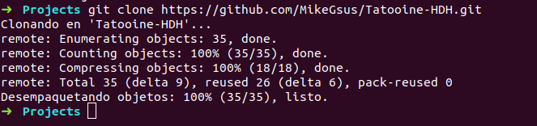
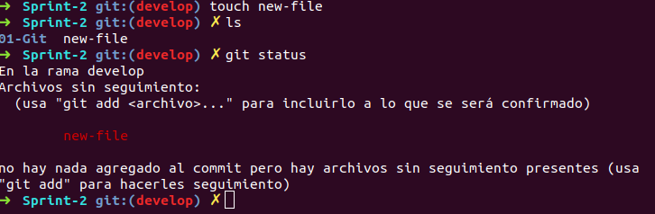
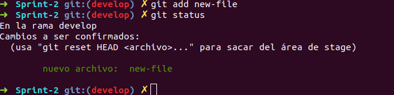
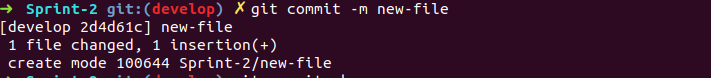
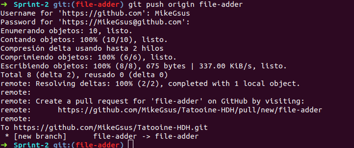
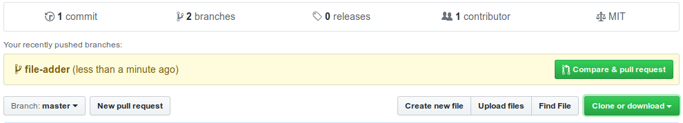
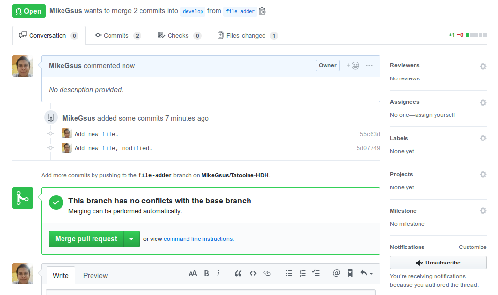
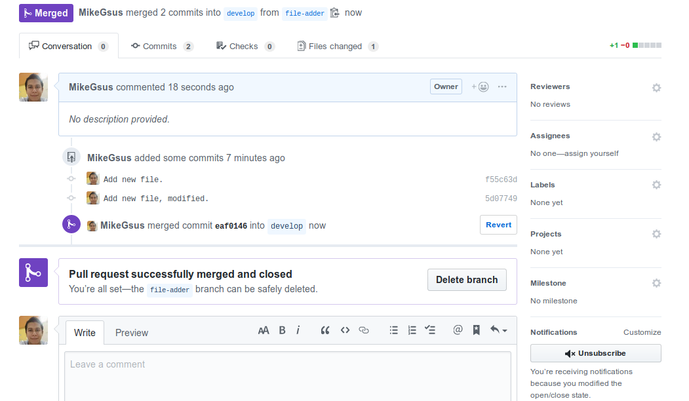

# Git Flow Tutorial

Viajar en el tiempo ya no parece tan lejano a la realidad, al menos no en la informática, y Git aporta en gran medida a ello. Este Sistema de Control de Versiones nos permite ir directo al pasado para mirar los cambios que se han efectuado y modificar lo que haya salido más para solucionar el caos en la linea temporal actual.

El Git Flow permite movernos con mayor seguridad a través del espacio-tiempo y consiste en los siguientes pasos:

#### 1. Iniciar el repositorio

Lo primero que necesitamos para iniciar el Git Flow es tener un repositorio en el cual trabajar. Desde aquí existen dos caminos:
- Crear un repositorio
- Clonar un repositorio

Con el primero debemos crear un directorio en nuestro equipo y desde la terminal (preferentemente en el directorio) ingresar el siguiente comando: `git init <nombre del directorio>`.

En el segundo caso, desde el GitHub, BigBucket, etcetera; se copia la URL del repositorio y en la terminal se usa `git clone https://www.url-sitio.com`. Éste comando crea una carpeta con el nombre del repositorio y copia todos el contenido en ella.

#### 2. Crear rama

Con el repositorio en nuestro equipo, y para no estropear el trabajo propio o de todo el equipo, es muy importante crear una rama con una instancia del repositorio que podamos modificar y en caso de error no afecte la versión estable del proyecto.

Esta nueva rama puede ser creada con dos comandos:
- `git branch <nombre de la rama>`
- `git checkout -b <nombre de la rama>`, este crea la rama y nos posiciona en ella.

El nombre de la rama deber ser especifico sobre la tarea que se hará en ella. Es preferible crear dos, una general que se encargue de la administración de los *merge* y la otra donde se trabaje en lo especifico.

#### 3. Crear archivo

 Lo siguiente en el flujo es crear un archivo nuevo, el cuál en primera instancia se mostrará como **untracked**, *status* que significa que no se ha creado ningún registro del archivo.

#### 4. Iniciar el seguimiento

Lo siguiente es crear el primer registro del archivo, que se mostrará en *status* **tracked** después de usar los comandos `git add <nombre del archivo>`. De aquí en adelante el archivo permanecerá en *staged* hasta que se comprometa en un **commit**.

#### 5. Iniciar el *commit*

Con `git add`hemos agregado el archivo y su ruta dentro del repositorio a la instancia de la rama en la que trabajamos y con `git commit <archivo>` confirmas que la última versión del archivo añadida con `git add` es la que será registrada en la instancia y la que puede ser enviada al *origin* o servidor central.

Es de suma importancia agregar un mensaje claro al *commit*, que nos permita identificar cuales han sido los cambios y en caso de ocurrir algún fallo sea más sencillo saber donde corregir.

#### 6. Empujar al *origin*

Ya que hemos trabajado en nuestros archivos, han sido agregados a la instancia y confirmados es momento de enviar la instancia al *origin* y hacer *merge* ente los datos actuales y antiguos.

Para llevar nuestros avances al servidor central debemos ejecutar `git push origin <nombre de la rama>`, y todo lo que esté en *commited* será enviado.

#### 7. Mezclar las ramas

Una vez hecho el `git push` desde la plataforma donde se administre nuestro proyecto en el servidor central debemos mezclar nuestros avances con lo ya existente en una rama de administración diferente al *master*.

Se debe eliminar la rama donde se trabajó, puesto que sólo se ha creado para la tarea terminada y nada más; de no hacerlo se irán acumulando y podrían causar confusión.
